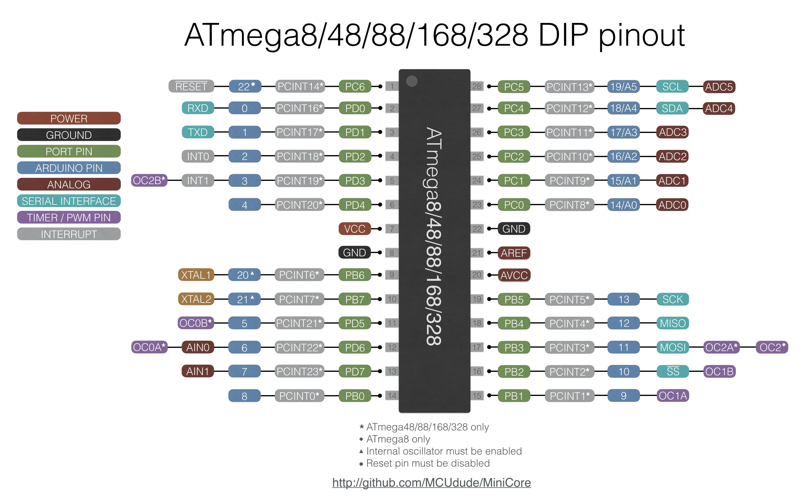

# 🔥 Heat Plate Controller 

**Microcontroller Supported**: ATmega328P / ATmega168 / ATmega8  
**Author**: Javier Rayhan  
**Project Start**: April 11, 2025

---

## 📌 Project Description

Heat Plate Controller OLED/16x2 I2C is a microcontroller-based temperature controller designed for precise heat management using a relay and thermistor. It’s perfect for:

- DIY soldering stations  
- Compact lab heating devices

This project lets you set your desired temperature using a rotary encoder and monitor the current temperature on an OLED or 16x2 I2C display. A relay module automatically toggles based on the temperature to maintain stability.

---

## 🧰 Hardware Components

| Component            | Quantity | Notes                                        |
|----------------------|----------|----------------------------------------------|
| ATmega328P / ATmega168 / ATmega8 | 1        | Main microcontroller                         |
| 100k NTC Thermistor  | 1        | With BETA = 3950 (check your datasheet)      |
| OLED 128x64 I2C      | 1        | For displaying temperature and status        |
| Rotary Encoder       | 1        | Used to set target temperature               |
| Encoder Push Button  | 1        | Toggles heating ON/OFF                       |
| Relay Module         | 1        | Controls power to heating element            |
| Resistors 10K        | 1        | Pull-ups for Reset                           |
| Resistors 100K       | 1        | Pull-ups for Thermistor                      |
| Breadboard / PCB     | 1        | For circuit assembly                         |
| LED                  | 1        | Power Indicator                              |
| 5V Power Supply      | 1        | Powers microcontroller and relay             |

---

## 🔌 Wiring Schematic

| Component              | ATmega Pin | Description                |
|------------------------|----------------|----------------------------|
| Display SDA            | A4             | I2C Data line              |
| Display SCL            | A5             | I2C Clock line             |
| Thermistor             | A0             | Analog temperature input   |
| Encoder Pin A          | D2             | Interrupt-enabled pin      |
| Encoder Pin B          | D3             | Interrupt-enabled pin      |
| Encoder Button         | D6             | Active LOW input           |
| Relay IN               | D7             | Output control to relay    |
| VCC (All modules)      | 5V             | Power supply               |
| GND                    | GND            | Ground                     |

---

## 📺 Display Output Example

